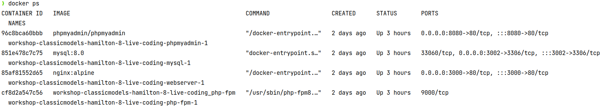
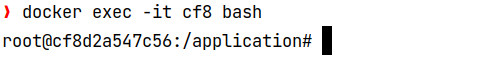
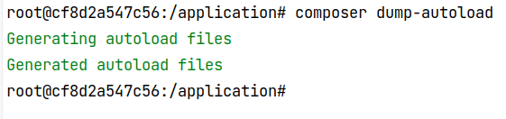
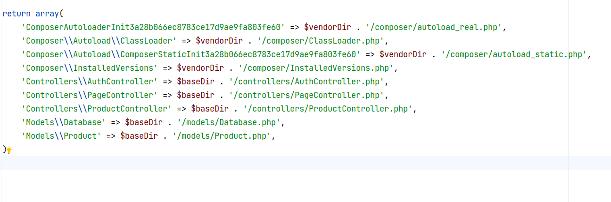

# How to Autoload ?

Petit mode d'emploi pour utiliser [Composer](https://getcomposer.org/doc/01-basic-usage.md), un [autoloader](https://laracasts.com/series/php-for-beginners-2023-edition/episodes/47) et quelques tips pour exécuter des commandes dans un container [Docker](https://docs.docker.com/engine/reference/commandline/exec/).

## 1 - Exécuter des commandes Docker dans votre container

Afin d'utiliser Composer dans votre container _php-fpm_, il va falloir tout d'abord trouver ce container, et lancer une session shell dedans (a.k.a lancer le terminal _dans_ votre container..)

Pour cela, la première étape est de déterminer l'**id** du container php-fpm, en utilisant la commande suivante :`docker ps`.

Le résultat vous donnera la liste des containers actuellement lancés, ainsi que dans la première colonne, leur identifiant : 


Une fois le container php identifié (ici _cf8d2a547c56_), il faudra utiliser la commande `docker exec` pour exécuter un script dans le container. Le script en question sera, dans notre cas, le lancement de _bash_, un programme shell.

La commande est la suivante : 
```
docker exec -it cf8 bash
```

Remarquez que je n'utilise que les 3 premiers caractères de l'ID du container. En effet, ceux-ci sont suffisants pour que Docker sache dans quel container je souhaite exécuter la commande.

Enfin, une fois cette étape franchie, vous arriverez sur la session bash dans votre container : 



## 2 - Installer Composer et son autoloader

Afin d'initialiser Composer dans votre projet, rendez vous dans le dossier /src et créez-y un fichier **composer.json**

Dedans, spécifiez que vous souhaitez utiliser l'autoload et, dans mon cas, pdo (sinon PHPStorm râle).

##### composer.json :
```json
{
  "autoload": {
    "classmap": [
      "./"
    ]
  },
  "require": {
    "ext-pdo": "*"
  }
}
```

Une fois cette étape complétée, rendez vous dans la session bash de votre container php, et installez les librairies requires par composer : 

`composer install`

Ceci devrait générer un dossier _vendor_ dans _src_, qui à l'instar de node_modules, contiendra les packages de votre app php.

Le fichier le plus important de ce dossier est **autoload.php**, vous **devez** l'importer lorsque vous lancer l'application php (c'est à dire au début de _index.php_ si vous utilisez un router).

```php
<?php
declare(strict_types=1);

require_once 'vendor/autoload.php';
```

## 3 - Ajout de classes et mise à jour de l'autoloader

Lorsque vous souhaitez utiliser une classe en PHP, vous aller désormais devoir lui attribuer un _namespace_, c'est à dire un genre de préfixe dans leur noms qui permet de ne pas avoir de conflits entre deux classes qui porteraient le même nom. _(Imaginez le nombre de classes qui s'appellent **User** ou **Database** sur le net!)_

Pour cela, chaque classe fera partie d'un namespace donc, que je répartis ici en fonction du nom du dossier dans lequel elle se situe : 
* `App\Controllers\ProductController`
* `App\Controllers\PageController`
* `App\Models\Product`

Dans le fichier de votre classe, vous devrez donc indiquer le namespace en début de fichier ainsi que les classes qu'elle utilise, en spécifiant leur namespace grâce à l'instruction _use_ :

```php
<?php
declare(strict_types=1);

namespace App\Controllers;

use Exception;
use App\Models\Product;

class ProductController
{ 
    ...
```

Enfin, n'oubliez pas de spécifier les _use_ dans votre index.php, car sinon pas moyen d'appeler les controllers :

```php
<?php
declare(strict_types=1);

require_once 'vendor/autoload.php';

use App\Controllers\AuthController;
use App\Controllers\PageController;
use App\Controllers\ProductController;

session_start();

...
```

## 4 - J'ai créé une nouvelle classe et ça ne marche pas !

Et bien c'est normal, car en l'état, Composer n'est pas configuré pour automatiquement mettre à jour son autoloader quand vous ajoutez une classe ! Il faut donc indiquer à Composer que vous voulez mettre à jour la liste de son autoloader. La manipulation est simple : rendez vous dans votre session bash du container php-fpm (comme d'hab) et exécutez la commande suivante : 

`composer dump-autoload`



Et voilà, plus qu'à réessayer, et si tout est bien configuré, ça devrait fonctionner ! 

## 5 - En cas d'erreur

En cas d'erreur, vérifiez le fichier _vendor/composer/autoload_classmap.php_, car celui-ci contient la liste des classes qui seront autoloadées dans votre projet. Si les "chemins" ne correspondent pas à la structure de votre projet, l'erreur doit provenir de là ! (Par exemple un namespace Controllers (avec _s_) et un dossier /controller (sans _s_)).



## 6 - L'autoload automatique ?? Plus besoin de faire tourner `dump-autoload` ? Je signe !

Comme précisé dans la [documentation de Composer](https://www.php-fig.org/psr/psr-4/), il est possible de configurer son autoloading de façon à ne plus jamais devoir faire tourner la commande `composer dump-autoload` !

Pour cela, il faut utiliser l'option PSR-4. (Vous vous souvenez des PSR ? Les "normes" de PHP sont de retour !)

De mon coté, j'ai bougé toutes les classes dans un dossier _app_ et ai préfixé leur namespace avec _App\_, ce qui donne : 
`namespace App\Controllers;` au lieu de `namespace Controllers;`.

Ce qui est bien, c'est que si votre App a un nom particulier, vous pouvez appeler le namespace "lié" à votre dossier app comme vous voulez, comme par exemple `MaSuperApplicationQuiVaMeRendreRiche\Controllers` !

Seul souci, et bien il va falloir refactorer à nouveau pour mettre à jour le namespace de toutes mes classes, et les bouger dans un dosser app/, mettre des majuscules aux dossiers qui ont un namespace (comme `Controllers` au lieu de `controllers`) mais c'est un faible prix pour ne jamais redevoir faire tourner `dump-autoload`! ;)

Vous pouvez voir le résultat dans la version mise à jour du projet dans ce repo-même !
